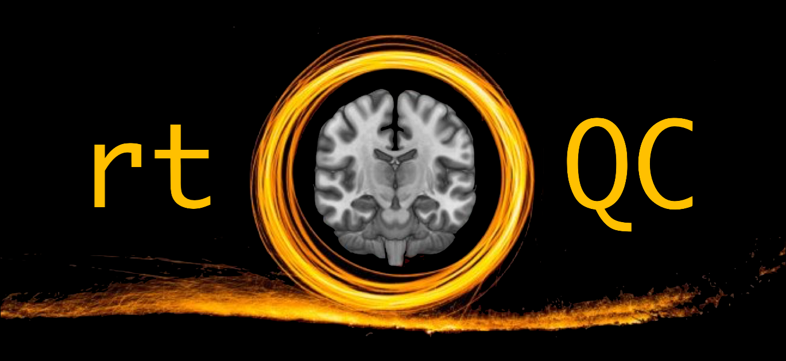

# rtQC

A toolbox for real-time fMRI Quality Control.



## Description

rtQC is a Matlab-based graphical user interface (GUI) that allows quality control and visualization of typical fMRI data prior to data collection (**Pre-QC**), during data collection (**Online QC**) and after data collection (**Post-QC**).

## Intended usage

The GUI can help fMRI users from student novices to experienced clinicians to perform QC in real-time, both on pre-acquired datasets as well as online during a scanning session. rtQC is compatible with NIfTI data. Data exported from the scanner in different formats (in real-time or offline) will have to be converted to NIfTI format before entry into rtQC.

## Dependencies

rtQC requires Matlab 2016b (or higher) and the latest version of [SPM12](https://www.fil.ion.ucl.ac.uk/spm/software/spm12/) to execute correctly. Further dependencies are provided together with this code base (in the 'external' folder)

## Installation and usage

You can download the code base as a .zip-folder from this repository, or alternatively clone or fork the repository depending on your preference. The rtQC folder and it's contents will have to be added to the Matlab path. Once this is done, call the following file from the Matlab workspace:

```
rtQC_display
```

The GUI will open on the home tab, with links to this Github repository, the documentation (under development) and the Pre-QC tab. All tabs contain useful descriptions of each section to guide users along the way through Pre-, Online and Post-QC steps.

For efficient use, some information should be entered prior to usage into the following file:
```
rtQC_defaults
```
This includes information like the location of the SPM12 installation, pointers to preloaded data and experimental design parameters.

## Features

Currently, rtQC features:
1. Pre-QC
  * General settings, including thresholds
  * Anatomical-functional preprocessing for masks and ROIs.
  * Mutual information check between offline exported and real-time acquired data
2. Online QC
  * Minimal real-time preprocessing
  * Real-time QC metric display
  	* Framewise Displacement (FD)
  	* Global Z-score
  	* tSNR
  	* Grayplot
  * FD-based outlier detection
3. Post QC
  * Offline single session QC metrics calculation and visualization
  * Export of scan nulling regressor
  * Triggering of standard fMRI QC pipelines

## Contributing

Any conributions are much appreciated! Contributions can be in the form of submitting Github issues about bugs, feature requests, enhancement ideas, or even pull requests! When contributing, please adhere to the contributor Code of Conduct (available via CODE_OF_CONDUCT.md)

## Citation

If you use rtQC in your work, please cite the following:

```
Heunis, S., Hellrung, L., Meer, V.D., Bergert, S., Sladky, R., Pamplona, G.S.P., Scharnowski, F., Koush, Y., Mehler, D., Falcon, C., Gispert, J.D., Molinuevo, J.L., Skouras, S., 2019. rtQC: an open-source toolbox for real-time fMRI quality control. Proceedings of the 25th annual meeting of the Organization for Human Brain Mapping, Rome, Italy. https://doi.org/10.5281/zenodo.3239084
```

Link to poster: [](https://doi.org/10.5281/zenodo.3239084)

## License

rtQC is licensed under the GNU GENERAL PUBLIC LICENSE for free and open-source software. For more detail, please see LICENSE.


